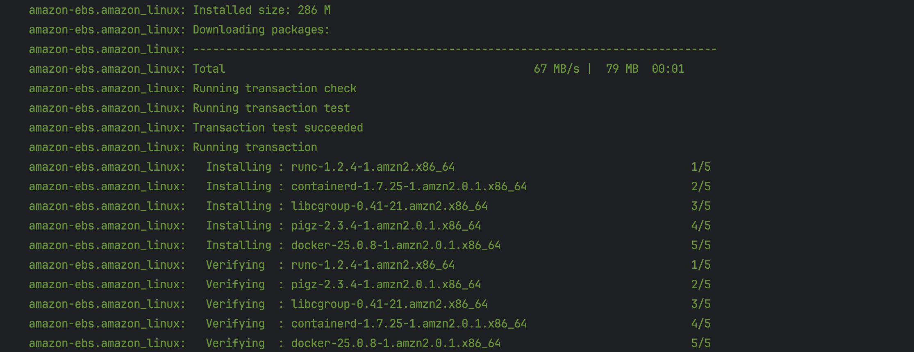

# 🛠️ AWS Infra with Packer and Terraform

This project provisions a VPC on AWS, sets up a bastion host in the public subnet, and deploys 6 EC2 instances in the private subnet using a custom AMI built with Docker and SSH access.

## 🔧 Stack

- **Packer**: For AMI creation
- **Terraform**: For infrastructure provisioning
- **Amazon Linux 2** + **Docker**

---

## ✅ Setup Instructions

### 1. Install parker & terraform
```bash
brew install hashicorp/tap/parker
brew install hashicorp/tap/terraform
```

### 2. AWS cli
```bash
brew install awscli

export AWS_ACCESS_KEY_ID=your_temp_access_key_id
export AWS_SECRET_ACCESS_KEY=your_temp_secret_access_key
export AWS_SESSION_TOKEN=your_temp_session_token
export AWS_DEFAULT_REGION=us-east-1
```

### 3. Generate SSH Key

```bash
ssh-keygen -t rsa -f ssh/id_rsa

aws ec2 import-key-pair \
  --key-name "packer-keypair" \
  --public-key-material fileb://ssh/id_rsa.pub
```


## ✅ Parker
```bash
packer init .
packer build docker-ami.pkr.hcl
```





## ✅ Terraform
Replace "172.92.13.164/32" with your actual public IP in CIDR format in "variables.tf":
```bash
variable "my_ip" {
default = "172.92.13.164/32" # Replace with your own IP
}
```
Update the AMI ID with your AMI ID generated in Parker step:
```bash
variable "custom_ami_id" {
default = "ami-03bb0432716e2009f" # Replace with your own AMI ID
}
```
Deploy
```bash
terraform init
terraform plan
terraform apply
```


